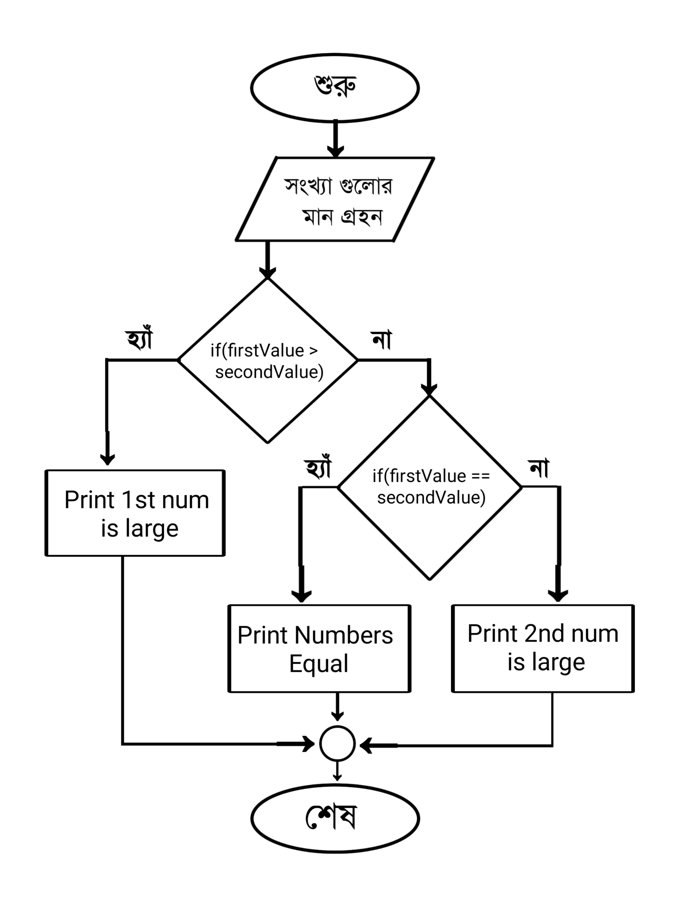
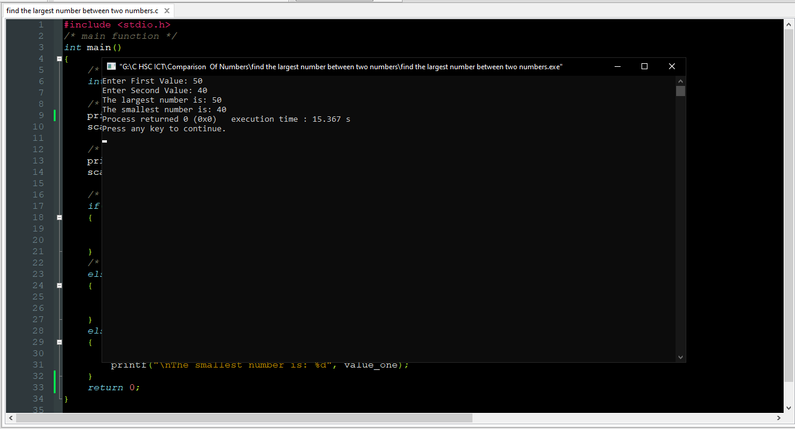

<!-- CIRCLE_TOOLS -->
<!-- CODED BY ARU -->
<div align='center' sytle='color:red'><h1> দুইটি সংখ্যার মধ্যে বৃহত্তম সংখ্যা নির্ণয় </h1></div>
<div align="center"><h1><b><i> Algorithm </i></b></h1></div>
<div align="left">
  <p> <b><i>ধাপ -১ঃ </i></b> প্রোগ্রাম শুরু। </p>
  <p> <b><i>ধাপ -২ঃ </i></b> দুটি সংখ্যা first_value এবং second_value এর মান গ্রহন। </p>
  <p> <b><i>ধাপ -৩ঃ </i></b> প্রথম সংখ্যাটি দ্বিতীয় সংখ্যা থেকে বড়?</p>
  <ul>
     <ol>
	<li> হ্যাঁ, প্রথম সংখ্যাটি প্রিন্ট করো এবং ৫নং ধাপে যাও।</li>
	<li> না, ৪নং ধাপে যাও। </li>
     </ol>
  </ul>
  <p> <b><i>ধাপ -৪ঃ </i></b> নাম্বার দুটি সমান? </p>
  <ul>
     <ol>
	<li> হ্যাঁ, নাম্বার দুটি সমান লেখাটি প্রিন্ট করো এবং ৫নং ধাপে যাও।</li>
	<li> না, দ্বিতীয় সংখ্যাটি প্রিন্ট করো এবং ৫নং ধাপে যাও। </li>
     </ol>
  </ul>
  <p> <b><i>ধাপ -৫ঃ </i></b> প্রোগ্রাম শেষ।</p>
</div>
<div align="center">
<h1><b><i> Flowchart </i> </b></h1>

</div>

<div align="center">
<h1> <b> Source Code </b> </h1>
<div align="left">

```c
#include <stdio.h>
/* main function */
int main()
{
    /* two variable declarations to store numbers taken from the user */
    int value_one, value_two;

    /* Input First value */
    printf("Enter First Value: ");
    scanf("%d",&value_one);

    /* Input Second Value */
    printf("Enter Second Value: ");
    scanf("%d",&value_two);

    /* Check which is largest Number and which is smallest number*/
    if(value_one > value_two)
    {
        printf("The largest number is: %d", value_one);
        printf("\nThe smallest number is: %d", value_two);
    }
    /* Check if Two Numbers are equal */
    else if (value_one == value_two)
    {
        printf("Numbers is equal");

    }
    else
    {
        printf("The largest number is: %d", value_two);
        printf("\nThe smallest number is: %d", value_one);
    }
    return 0;
}

```

</div>
</div>
<div align="center">
<h1> Input Code Screenshot</h1>

<h1> Output Screenshot </h1>

</div>
